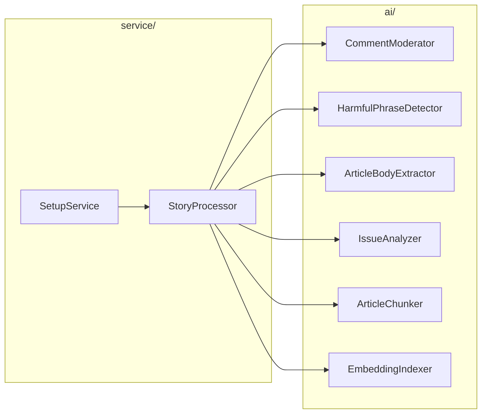
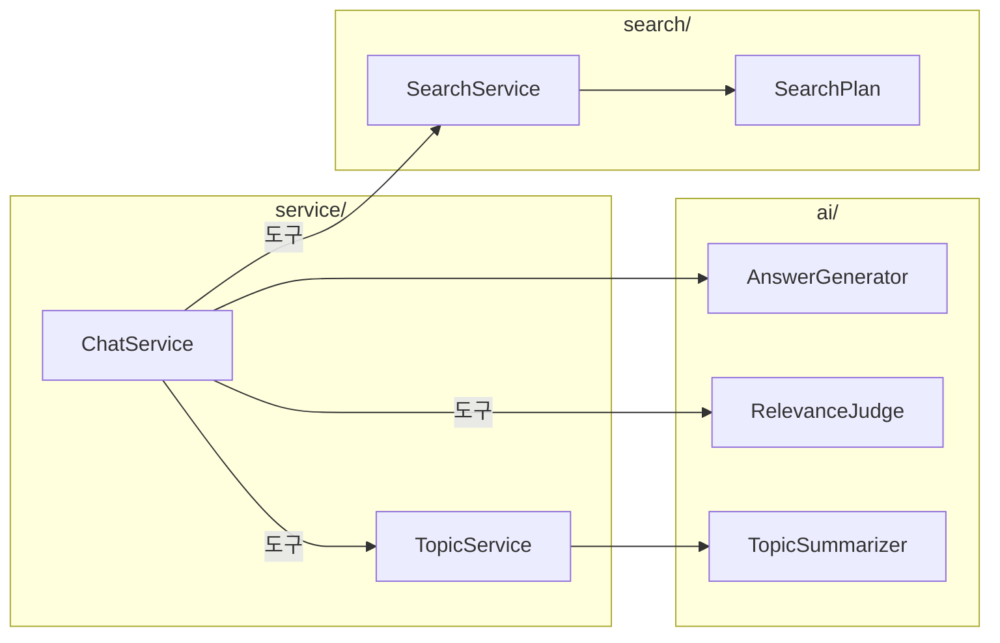
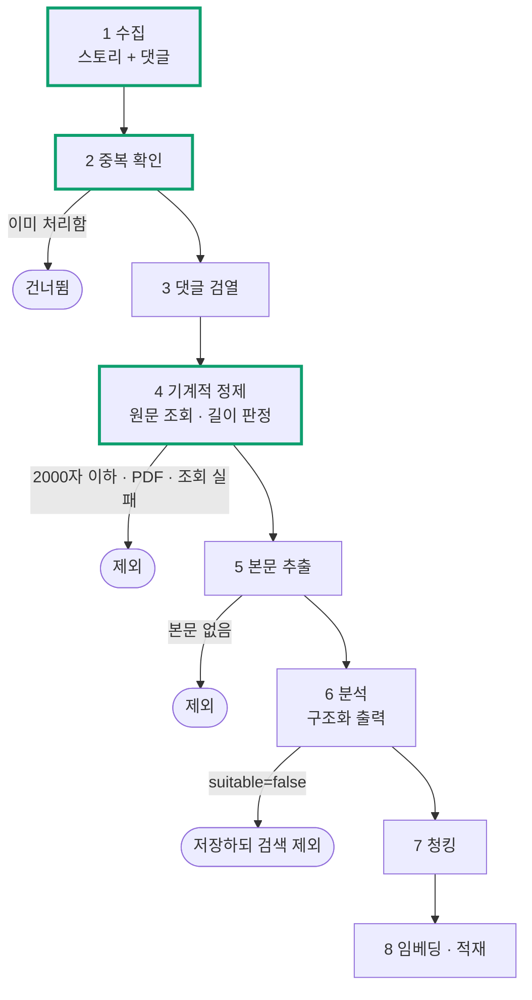
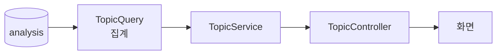
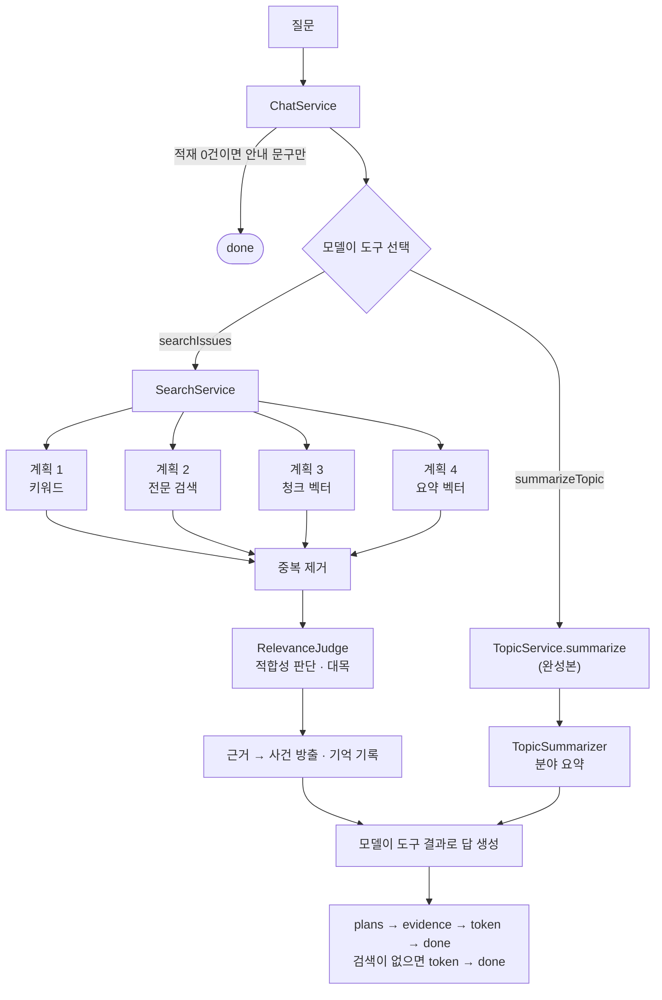
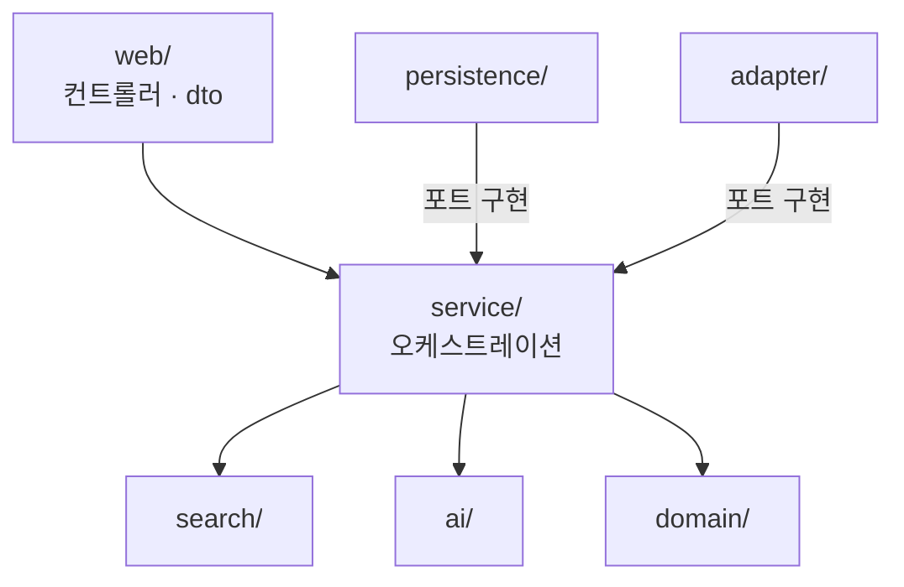
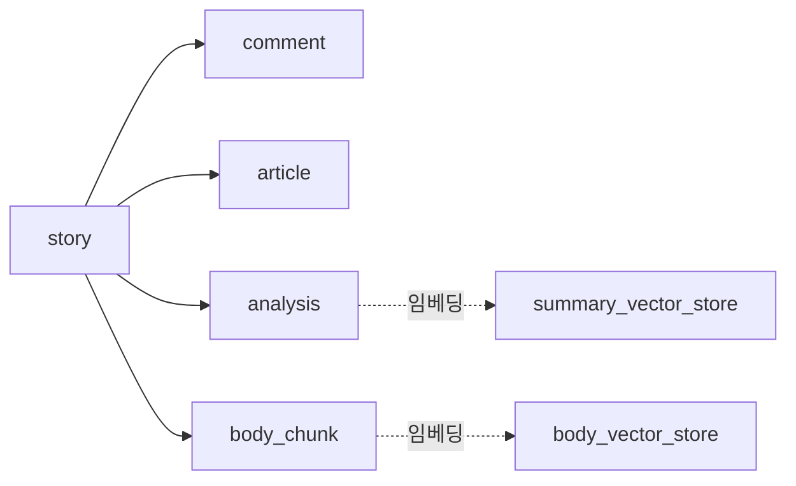

# 02. 전체 구조

빈 구현은 여러 패키지에 흩어져 있지만, **데이터 흐름**을 알면 어느 것부터 구현해도 됩니다.

---

## 인터페이스 구성

패키지가 서로를 어떻게 부르는지 **인터페이스만으로** 봅니다. 호출은 셋업과 Q&A
두 갈래이고, 둘 다 화살표가 `service/` 에서만 나갑니다.

**셋업**



`search/` 가 나오지 않습니다. 셋업은 검색을 쓰지 않습니다. `SetupService` 는 스토리
목록을 돌리기만 하고, **모델 호출은 전부 `StoryProcessor` 하나에 모여 있습니다.**

**Q&A**



「도구」가 붙은 셋은 **모델이 호출할지를 정합니다.** `ChatService` 가 `IssueTools` 로
묶어 등록하고, 그 안에서 `SearchService` · `RelevanceJudge` · `TopicService` 를 부릅니다.
`AnswerGenerator` 에 라벨이 없는 것은 도구가 아니라 system 프롬프트로 붙기 때문입니다.

**`ai/` 와 `search/` 에서 나가는 화살표는 없습니다.** 필요한 값은 전부 인자로 받습니다.
이 규칙은 아래 「계층」에서 다시 다룹니다.

---

## 완성본과 빈 구현

이 저장소에는 두 종류의 코드가 섞여 있습니다.

| | 제공 방식 | 식별 기준 |
| --- | --- | --- |
| **완성본** | 그대로 사용 | 나머지 전부 |
| **빈 구현** | 직접 구현 | 클래스 이름이 `*Shell`, 또는 `BodyVectorPlan` · `SummaryVectorPlan` · `IssueTools` |

빈 구현은 여섯 곳에만 있습니다.

```
ai/shell/                 LLM · Moderation 호출 9개
search/shell/             검색 서비스 1개
search/plan/              벡터 검색 계획 2개
service/chat/IssueTools   모델이 호출하는 도구 7종
service/setup/shell/      스토리 하나의 단계 처리 1개
service/chat/ChatServiceShell   Q&A 연결 1개
```

**각 클래스의 Javadoc 이 명세입니다.** 무엇을 받아 무엇을 돌려줘야 하는지, 주의할
점이 거기 적혀 있습니다. 필요한 의존성은 생성자로 이미 주입되므로 빈(Bean) 설정을
새로 작성할 필요는 없습니다.

---

## 흐름 1: 셋업 파이프라인

「데이터 셋업」 탭의 버튼으로 시작합니다. 8단계를 거쳐 DB 를 채웁니다.



테두리가 굵은 단계가 완성본(수집 · 중복 확인 · 기계적 정제)이고 나머지는 빈 구현입니다.

| 단계 | 빈 구현 | 완성본 |
| --- | --- | --- |
| 1 수집 | | `StorySource`: 목록 조회와 댓글 트리 순회 |
| 2 중복 확인 | | `SetupQuery.isProcessed` |
| 3 댓글 검열 | `CommentModerator` · `HarmfulPhraseDetector` | |
| 4 기계적 정제 | | `ArticleSource`: 조회와 태그 제거 · `PipelinePolicy.check`: 길이 판정 |
| 5 본문 추출 | `ArticleBodyExtractor` | |
| 6 분석 | `IssueAnalyzer` | `AnalysisMapper`: 엔티티 변환 |
| 7 청킹 | `ArticleChunker` | |
| 8 적재 | `EmbeddingIndexer` | 벡터 스토어 2개 |

실행 · 진행 상황 · 로그는 완성본 `PipelineSetupService` 가 맡습니다. 스토리 하나를 2~8단계로 처리하는
`StoryProcessor` 만 빈 구현입니다.

> **판정 결과와 무관하게 원본은 모두 저장합니다.** 제외된 스토리와 사유를 나중에
> 조회할 수 있어야 하기 때문입니다. 4단계에서 탈락한 스토리는 다음 단계로 넘어가지 않고,
> 6단계에서 부적합으로 판정된 것은 저장하되 검색에서 뺍니다.

---

## 흐름 2: 주제 탐색

**빈 구현이 없습니다. 모두 완성본입니다.**



완성본으로 제공하는 이유는 벡터도 LLM 도 쓰지 않는 메타데이터 집계라 Spring AI 학습
요소가 없기 때문입니다.

**그래서 이 탭으로 진척을 확인할 수 있습니다.** 6단계 `IssueAnalyzer` 를 채워 분석 결과가
한 건이라도 쌓이면 **이 탭의 잠금이 바로 해제됩니다.** 파이프라인 전체를 완성하지 않아도 됩니다.

---

## 흐름 3: Q&A

질문을 받아 답변을 내보내기까지의 흐름입니다.



네 계획을 **전부** 수행하고 각각 상위 5건을 받습니다. 한 계획이 0건이어도 나머지 계획의
결과로 후보를 채웁니다. 모델이 분야나 원문 타입을 지정하면 모든 계획에 필터로 걸립니다.

**답은 `searchIssues` 를 호출한 모델이 한 번에 생성합니다.** 도구가 근거와 계획별 실행 조건을
돌려주면, 모델은 그것으로 답하고 필요하면 어떤 조건으로 찾았는지도 설명합니다.

**점수는 합치지 않습니다.** 불리언 · `ts_rank` · 코사인 거리는 서로 비교할 수 없는
척도이기 때문입니다. 최종 순위는 `RelevanceJudge` 가 정합니다.

프론트엔드는 `plans` → `evidence` → `token` 순서로 이벤트를 받아 화면을 차례로 그립니다.
사이드바 검색 계획(계획별 건수와 실행 조건)이 먼저 채워지고, 근거 카드가 표시되고, 답변이 타이핑되듯 나타납니다.

---

## 계층

구현하다 보면 "왜 여기서 저걸 못 부르지?" 라는 의문이 생깁니다. 규칙이 하나 있습니다.

**안쪽 계층은 바깥쪽 계층을 모릅니다.**



- **`ai/` 와 `search/` 는 아무것도 참조하지 않습니다.** DB 도 도메인 엔티티도
  모릅니다. 필요한 것은 인자로 받습니다.
- **`service/` 는 `web/` 도 `persistence/` 도 모릅니다.** 바깥 세계와는 **포트**로만
  만납니다 (`StorySource` · `ArticleSource` · `SetupStore` 등). 그 구현은 인프라가 맡습니다.
- **`persistence/` 와 `adapter/` 의 화살표는 위를 향합니다.** DB 든 외부 API 든 똑같이
  바깥 세계이므로 한쪽만 예외로 두지 않습니다.

`LayeringTest` 가 이 규칙을 강제합니다. 어기면 `./gradlew test` 가 잡아냅니다.

---

## 데이터 저장 위치



| 테이블 | 내용 | 적재 단계 |
| --- | --- | --- |
| `story` · `comment` | 수집 원본 (댓글은 마스킹된 텍스트) | 1 · 3 |
| `article` | 원문 처리 결과. **이 행의 존재가 중복 확인 기준** | 4 · 5 |
| `analysis` | 분석 결과. `suitable` 이 검색 대상 여부 | 6 |
| `body_chunk` | 본문 청크 | 7 |
| `summary_vector_store` | 요약 임베딩 (스토리당 1행) | 8 |
| `body_vector_store` | 청크 임베딩 (스토리당 N행) | 8 |
| `SPRING_AI_CHAT_MEMORY` | 대화 기억 | Q&A |

벡터 스토어를 둘로 나눈 이유는 짧은 요약과 긴 청크가 같은 순위 경쟁을 하지 않게 하기
위해서입니다. 덕분에 "요약에서만 찾기" 같은 검색 계획을 세울 수 있습니다.

pgAdmin(http://localhost:5050) 에서 직접 들여다볼 수 있습니다.

---

## 다음 문서

[03. 구현](03-구현.md) 에 빈 구현마다 입력 · 출력 · 확인 방법이 정리돼 있습니다.
